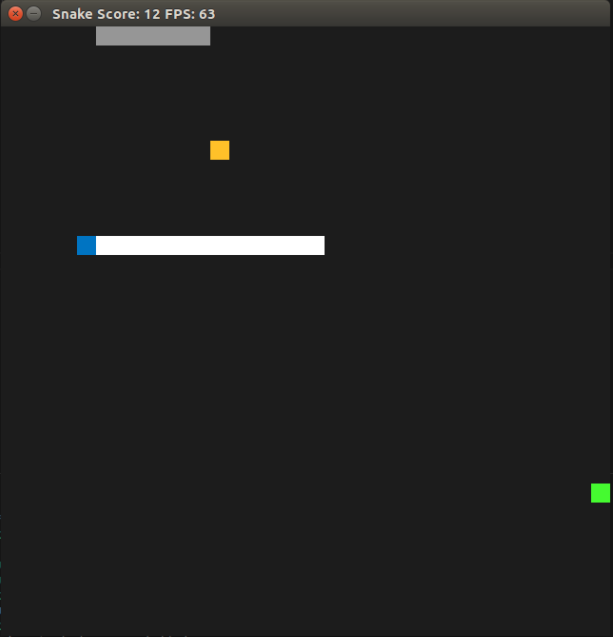

# CPPND: Capstone Snake Game

This is a fork repo from Udacity C++ Nanodegree Capstone. The snake can move freely on the screen and will grow and move faster every time it consumes food (yellow block). The snake will die if it hits itself or wall obstacle (grey block), which will grow every time the snake consume the food. There is a bonus block that will appear some time in the game that will last 5 sec. If the snake can consume the bonus, it will decrease its speed and the wall will disappear. Have fun playing!

## Dependencies for Running Locally
* cmake >= 3.7
  * All OSes: [click here for installation instructions](https://cmake.org/install/)
* make >= 4.1 (Linux, Mac), 3.81 (Windows)
  * Linux: make is installed by default on most Linux distros
  * Mac: [install Xcode command line tools to get make](https://developer.apple.com/xcode/features/)
  * Windows: [Click here for installation instructions](http://gnuwin32.sourceforge.net/packages/make.htm)
* SDL2 >= 2.0
  * All installation instructions can be found [here](https://wiki.libsdl.org/Installation)
  * Note that for Linux, an `apt` or `apt-get` installation is preferred to building from source
  * Don't forget to run `sudo apt-get update` and `sudo apt-get upgrade` before installation
* gcc/g++ >= 5.4
  * Linux: gcc / g++ is installed by default on most Linux distros
  * Mac: same deal as make - [install Xcode command line tools](https://developer.apple.com/xcode/features/)
  * Windows: recommend using [MinGW](http://www.mingw.org/)

## Basic Build Instructions

1. Clone this repo.
2. Make a build directory in the top level directory: `mkdir build && cd build`
3. Compile: `cmake .. && make`
4. Run it: `./SnakeGame`

## Project Rubic Points

This project meets the following rubric points:

### Loop, Functions, I/O
* The project demonstrates an understanding of C++ functions and control structures
  * A variety of control structures are used in the project
  * The project codes is clearly organized into functions
* The project accepts user input and process the input
  * The project accepts input from keyboard to control the snake in the game

### Object Oriented Programming
* The project uses Object Oriented Programming techniques
  * The project code is organized into classes with class attributes to hold the data and class methods to perform tasks.
* Classes use appropriate access specifiers for class members
  * All class data members and methods are explicitly specified as public, protected, or private
* Class constructors utilize member initialization lists
  * All class members that are set to argument values are initialized through member initialization lists
    * Ex: Wall constructor in wall.cpp line 13
* Class abstract implementation details from their interfaces
  * All class member functions document their effects through function names or comments
* Classes encapsulate behavior
  * Appropriate data and functions are groups into classes. Member data that is subject to an invariant is hidden from the user. State is accessed via member functions.
    * Ex: Bonus class in bonus.h. Bonus object can spawn or kill itself through public function. It can also get its own position and reset its state through public function
* Overloaded functions allow the same function to operate on different parameters
  * One function is overloaded with different signatures for the same function name
    * Ex: function `Wall::WallCell()` in wall.h can accept input as `(int, int)` or `(SDL_Point const &)`
    * Ex: function `Wall::AddWall()` in wall.h can accept input as `()` or `(SDL_Point &)`

### Memory Management
* The project makes use of references in function declarations
  * At least two variables are defined as references, or two functions use pass-by-reference in the project code
    * Ex: function `Wall::WallCell()` in wall.h can accept input by reference as `(SDL_Point const &)` 
    * EX: function `Wall::AddWall()` in wall.h can accept input by reference as `(SDL_Point &)`
* The project uses destructors appropriately
  * At least one class that uses unmanaged dynamically allocated memory, along with any class that otherwise needs to modify state upon the termination of an object, uses a destructor
    * Ex: Renderer destructor in renderer.cpp is used with function `SDL_QUIT()` to appropriately terminate the program
* The project uses smart pointers instead of raw pointers
  * The project uses at least one smart pointer: `unique_ptr`, `shared_ptr`, or `weak_ptr`. The project does not use raw pointers.
    * Ex: All the raw pointers in renderer.h and renderer.cpp is converted into `unique_ptr`. No raw pointer is use anywhere else.